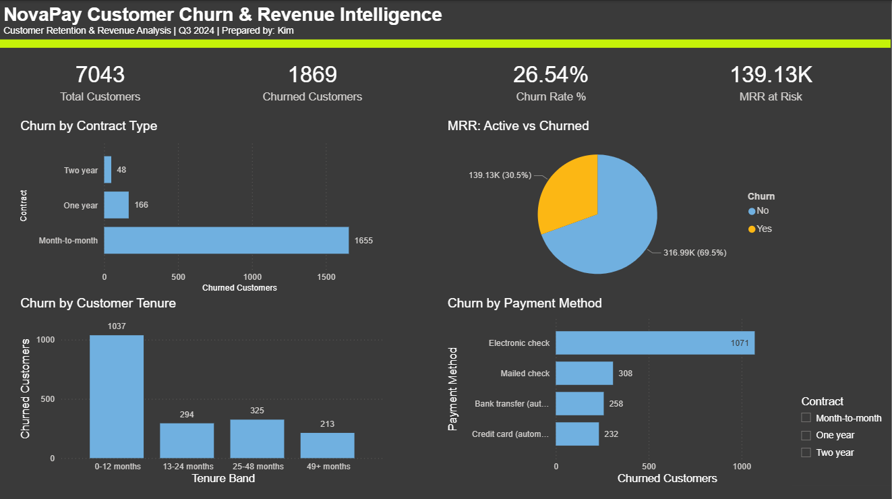

# NovaPay Customer Churn & Revenue Intelligence

**Role:** Data Analyst | **Tools:** PostgreSQL · Excel · Power BI  
**Domain:** FinTech · Customer Analytics · Revenue Intelligence

---

## Business Problem

NovaPay Financial Technologies is a digital payments startup serving 7,000+ customers across subscription-based financial products. The CFO flagged a potential revenue leak — churn was climbing but the team had no visibility into *who* was leaving, *why*, or *what it was costing the business*.

**I was tasked with answering three questions before the Q3 board meeting:**
1. How bad is our churn problem, and what is it costing us?
2. Which customer segments are at highest risk?
3. What should we do about it?

---

## Dataset

- **Source:** IBM Telco Customer Churn Dataset (via Kaggle)
- **Size:** 7,043 customers · 21 features
- **Key fields:** Tenure, contract type, monthly charges, payment method, churn label
- **Rebranded as:** NovaPay Financial Technologies for portfolio context

---

## Methodology

```
Raw Data → Data Cleaning → SQL Analysis → Business Insights → Dashboard → Recommendations
```

---

## SQL Analysis

Eight business questions answered in PostgreSQL. Full queries in `/sql/churn_analysis.sql`.

### Key Findings

| # | Business Question | Finding |
|---|---|---|
| 1 | Overall churn rate | **26.5%** — well above the 5–7% healthy benchmark |
| 2 | MRR at risk | **$139K+/month** lost to churned customers |
| 3 | Worst contract type | Month-to-month customers churn at **~42%** vs 3% for 2-year contracts |
| 4 | Revenue segment risk | High-value customers (>$65/mo) churn at nearly the same rate as low-value ones |
| 5 | Tenure risk window | **47%** of churned customers left within their first 12 months |
| 6 | Payment method risk | Electronic check users churn at **~45%** — 2x the rate of auto-pay customers |
| 7 | Lifetime value gap | Two-year contract customers deliver **8x CLV** vs month-to-month customers |
| 8 | High-value losses | Top 10 churned customers identified for immediate CS outreach |

---

## Dashboard

> Power BI dashboard covering executive KPIs, churn segmentation, CLV analysis, and retention recommendations.



---

## Key Recommendations

**Quick Wins (0–30 days)**
- Launch targeted retention campaign for month-to-month customers at 12-month tenure mark
- Migrate electronic check users to auto-pay via incentive offer

**Medium Term (30–90 days)**
- Build early warning system flagging customers in first 12 months with high churn-risk profile
- Create upgrade path incentives for month-to-month → annual contract conversion

**Long Term (90+ days)**
- Implement CLV-based customer segmentation across all marketing and CS touchpoints
- Develop onboarding programme specifically designed to get customers past the 12-month retention threshold

---

## Business Impact Estimate

| Action | Estimated Impact |
|---|---|
| Recover 20% of churned MRR | +$28K/month recurring revenue |
| Migrate 30% of e-check users to auto-pay | ~15% churn reduction in that segment |
| Improve 0–12 month retention by 10% | Significant CLV uplift across entire customer base |

---

## Repository Structure

```
novapay-churn-analysis/
├── data/
│   └── novapay_customers.csv
├── sql/
│   └── churn_analysis.sql
├── dashboard/
│   ├── novapay_powerbi.pbix
│   └── screenshots/
├── docs/
│   └── executive_summary.pdf
└── README.md
```

---

## Tools Used

| Tool | Purpose |
|---|---|
| PostgreSQL + pgAdmin | SQL analysis — churn rate, segmentation, CLV, cohort analysis |
| Excel | EDA, pivot tables, trend analysis |
| Power BI | Executive dashboard, KPI reporting |

---

## About This Project

This project was built as part of a data analyst portfolio sprint to demonstrate end-to-end analytics skills — from raw data to executive recommendations. The dataset was sourced from Kaggle and rebranded to simulate a real FinTech company scenario.

**Connect:** [LinkedIn](https://www.linkedin.com/in/akhimismail)· [GitHub](https://github.com/akhimismail)
